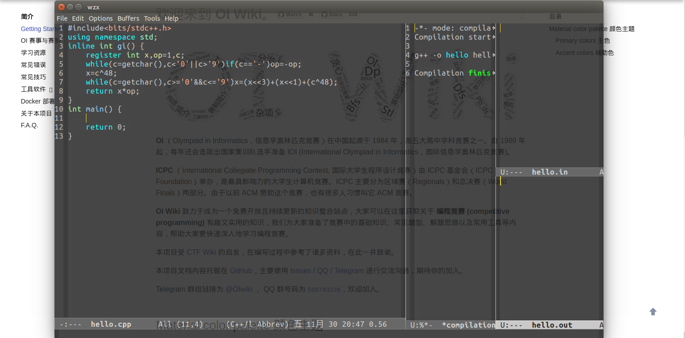

author: akakw1, Ir1d, partychicken, Xeonacid

## Emacs 入门教程

15 分钟入门 Emacs

### 简介

Emacs 是一款非常容易上手的编辑器，只需要简短的几行配置就能使用，但是想要非常熟练地使用 Emacs 进行各项工作还是需要一定的时间。

作为入门教程，这里仅介绍如何使用 Emacs 的基本功能并能够较方便地用 Emacs 编写、调试代码。

### 入门

这一部分用于介绍 Emacs 的基本功能及一些重要部分。

#### 命令

命令在 Emacs 中有很大的作用，但是由于一般用快捷键代替输入命令，所以这里只简单介绍一下。

使用右 Ctrl 左边的第一个键（不是 windows 键，在 windows 系统下需要手动设置这个键）或者快捷键 M-x（Alt+x）可以打开命令输入，输入完按下回车可以执行命令。

通常我们使用 `es` 或者 `eshell` 命令来打开 eshell（类似一个终端）。

#### 缓冲 (buffer)

缓冲即打开的文件和进程，在不保存的情况下，在缓冲中修改并不会修改到文件。

在缓冲区的底部点击缓冲的名字或者使用快捷键可以切换缓冲。

#### 编译、调试和运行

在顶部的菜单栏中有一个 Tools 点开就有编译和调试，或者你也可以输入命令或者自定义快捷键使用编译和调试功能。

运行可以使用终端或 Eshell 运行程序。

按下 Tools 中的调试 (gud-gdb) 后，输入程序名（一般会自动输好，但如果中途将程序另存为或者打开了两个需要调试的程序， **自动输好的文件名可能会有误** ）即可开始调试。

#### 分屏

这个功能便于我们查看各个缓冲的内容，而不需要来回切换缓冲，方便我们测试、调试代码。

分屏功能可以同时显示多个窗口，用鼠标拖动窗口的边缘可以缩放窗口。

几个快捷键：

-   删除分屏 "C-x 0"：将这个分屏删去
-   横向分屏 "C-x 3"：将这个分屏横向分成两半
-   纵向分屏 "C-x 2"：将这个分屏纵向分成两半

一般窗口分为四块：先横向分，调整一块的宽度约为 3/4 屏，作为编辑窗口，再将另一块横向分，一块作为调试和编译信息显示的窗口，另一块再纵向分，一块打开输入文件，一块打开输出文件。



#### 快捷键

Emacs 拥有极为丰富的快捷键，可以大幅提高写工作的效率，同时你也可以在配置中自定义快捷键或者设置快捷键的映射。

由于快捷键过多，所以 Emacs 快捷键的使用不同于我们的操作系统，一般有以下三种：

-    `F?` 、 `ESC` ：直接按下对应的功能键
-    `M-?` 、 `C-?` 、 `C-M-?` ：按下 `Alt` 或者 `Ctrl` （ `M-` 对应 `Alt` ， `C-` 对应 `Ctrl` ）的同时按下 `?` 
-    `? ?` ：先按下第一个 `?` 代表的键，松开再按下第二个 `?` 代表的键

下面是一些常用的快捷键：

-    `C-x h` ：全选
-    `C-x left` 、 `C-x right` ：切换到上/下一个缓冲
-    `C-x d` ：打开一个目录
-    `C-x C-f` ：打开一个文件（如果不存在文件则新建文件）

### 个性化

打开最初的 Emacs，非常丑，并且不好用，我们需要个性化设置。

由于配置不好记，所以部分可以直接设置的部分建议不要记配置

#### 直接设置

-   Options： `Highlight Matching Parentheses` 高亮匹配括号
-   Options： `Blink Cursor` 设置光标闪烁
-   Options Show/Hide： `Tool Bar` 显示/不显示工具栏（默认显示，建议不显示）
-   Options： `Use CUA Keys` 勾选后可以使用 Ctrl + C,Ctrl + V 等快捷键进行复制粘贴
-   Options Customize-Emacs： `Custom Theme` 选择配色方案，选择完后需要点击保存
-   Options： `Save Options`  **保存配置** 

#### 配置

在 home 目录下显示隐藏文件（Windows 系统在 **用户目录** 的 `AppData\Roaming` 目录下），".emacs" 就是配置文件（如果没有说明之前没保存），打开修改即可，如果有打开的 Emacs 需要重启 Emacs 生效。

考场必备

```text
;;设置一键编译 可以自行添加参数 难背考场不建议使用 不建议依赖一键编译
(defun compile-file ()(interactive)(compile (format "g++ -o %s %s -g -lm -Wall" (file-name-sans-extension (buffer-name))(buffer-name))))
(global-set-key [f9] 'compile-file)
;;;;设置编译快捷键（如果设置了一键编译不要与一键编译冲突）
;;(global-set-key [f9] 'compile)

(global-set-key (kbd "C-a") 'mark-whole-buffer) ;;全选快捷键
(global-set-key (kbd "C-z") 'undo) ;;撤销快捷键
(global-set-key [f10] 'gud-gdb) ;;GDB调试快捷键
(global-set-key (kbd "RET") 'newline-and-indent) ;;换行自动缩进
(global-set-key (kbd "C-s") 'save-buffer) ;;设置保存快捷键
(setq-default kill-ring-max 65535) ;;扩大可撤销记录

;;C++ 代码风格 一般控制缩进规则
;;;"bsd" 所有大括号换行
;;;"java" 所有大括号不换行。else 接在右大括号后面
;;;"awk" 只有命名空间旁、定义类、定义函数时的大括号换行。else 接在右大括号后面
;;;"linux" 只有命名空间旁、定义类、定义函数时的大括号换行。else 接在右大括号后面。一般来说，这个风格应该有 8 格的空格缩进
(setq-default c-default-style "awk")
```

??? "完整配置"
    ```text
    ;;设置一键编译
    (defun compile-file ()(interactive)(compile (format "g++ -o %s %s -g -lm -Wall" (file-name-sans-extension (buffer-name))(buffer-name))))
    (global-set-key [f9] 'compile-file)
    ;;;;设置编译快捷键（如果设置了一键编译不要与一键编译冲突）
    ;;(global-set-key [f9] 'compile)
    
    ;;考场必备
    (global-set-key (kbd "C-a") 'mark-whole-buffer) ;;全选快捷键
    (global-set-key (kbd "C-z") 'undo) ;;撤销快捷键
    (global-set-key [f10] 'gud-gdb) ;;GDB调试快捷键
    (global-set-key (kbd "RET") 'newline-and-indent) ;;换行自动缩进
    (global-set-key (kbd "C-s") 'save-buffer) ;;设置保存快捷键
    (setq-default kill-ring-max 65535) ;;扩大可撤销记录
    ;;(define-key key-translation-map [apps] (kbd "M-x")) ;; windows 系统下设置命令快捷键
    
    ;;设置缩进
    ;;;C++ 代码缩进长度。
    (setq-default c-basic-offset 4)
    ;;;使用 tab 缩进
    (setq-default indent-tabs-mode t)
    ;;;tab 的长度。务必和缩进长度一致
    (setq-default default-tab-width 4)
    (setq-default tab-width 4)
    
    ;;设置默认编码环境
    (set-language-environment "UTF-8")
    (set-default-coding-systems 'utf-8)
    
    ;;不显示欢迎页面
    (setq-default inhibit-startup-screen t)
    
    ;;设置标题
    (setq-default frame-title-format "")
    
    ;;显示行号
    (global-linum-mode t)
    
    ;;高亮
    (global-hl-line-mode 1);;高亮当前行
    (show-paren-mode t);;高亮匹配括号
    (global-font-lock-mode t);;语法高亮
    
    ;;允许emacs和外部其他程序的粘贴 好像默认允许
    (setq-default x-select-enable-clipboard t)
    
    ;;设置字体是 Ubuntu Mono 的 16 号，如果字体不存在会报错
    (set-default-font "Ubuntu Mono-16")
    ;(set-default-font "Consolas-16") ;; windows 系统请用这条
    
    ;;鼠标滚轮支持
    (mouse-wheel-mode t)
    
    ;;设置光标形状为竖线（默认为方块）
    (setq-default cursor-type 'bar)
    
    ;;回答 yes/no 改成回答 y/n
    (fset 'yes-or-no-p 'y-or-n-p)
    
    ;;透明度
    (set-frame-parameter (selected-frame) 'alpha (list 85 60))
    (add-to-list 'default-frame-alist (cons 'alpha (list 85 60)))
    
    ;;减少页面滚动的行数，防止整页地滚动
    (setq-default scroll-margin 3 scroll-conservatively 10000)
    
    ;;优化文件树结构
    (ido-mode t)
    
    ;;配色方案
    (setq default-frame-alist
             '((vertical-scroll-bars)
               (top . 25)
               (left . 45)
               (width . 120)
               (height . 40)
               (background-color . "grey15")
               (foreground-color . "grey")
               (cursor-color . "gold1")
               (mouse-color . "gold1")
               (tool-bar-lines . 0)
               (menu-bar-lines . 1)
               (scroll-bar-lines . 0)
               (right-fringe)
               (left-fringe)))
    
    (set-face-background 'highlight "gray5")
    (set-face-foreground 'region "cyan")
    (set-face-background 'region "blue")
    (set-face-foreground 'secondary-selection "skyblue")
    (set-face-background 'secondary-selection "darkblue")
    (set-cursor-color "wheat")
    (set-mouse-color "wheat")
    
    (custom-set-variables
     '(ansi-color-faces-vector
       [default default default italic underline success warning error])
    ;;启动 Ctrl-x Ctrl-c Ctrl-v = 剪切 复制 粘贴
     '(cua-mode t nil (cua-base))
     '(show-paren-mode t)
    ;;隐藏工具栏
     '(tool-bar-mode nil))
    ;;关闭光标闪烁
     '(blink-cursor-mode nil)
    (custom-set-faces)
    ```
